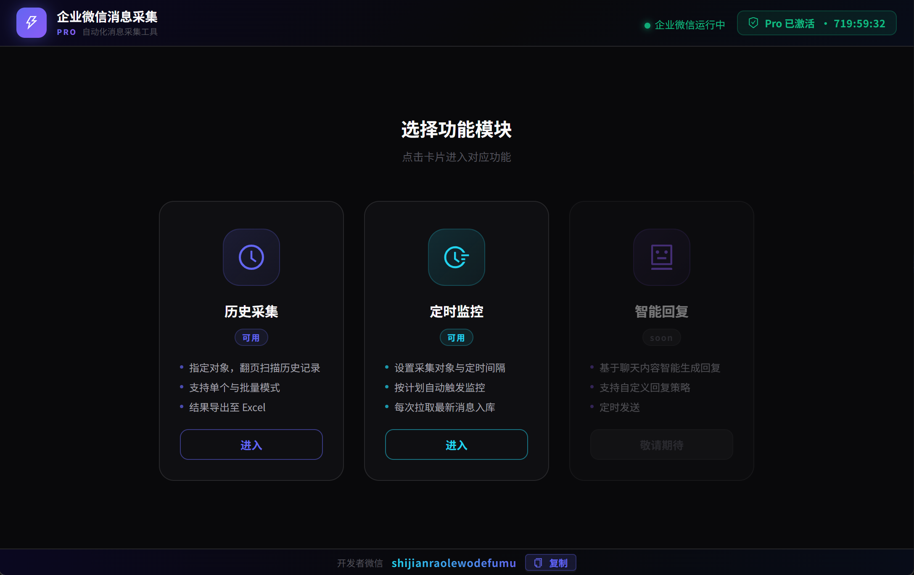
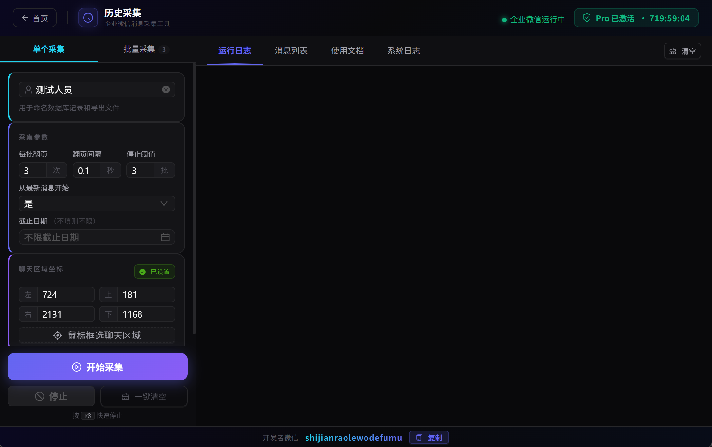
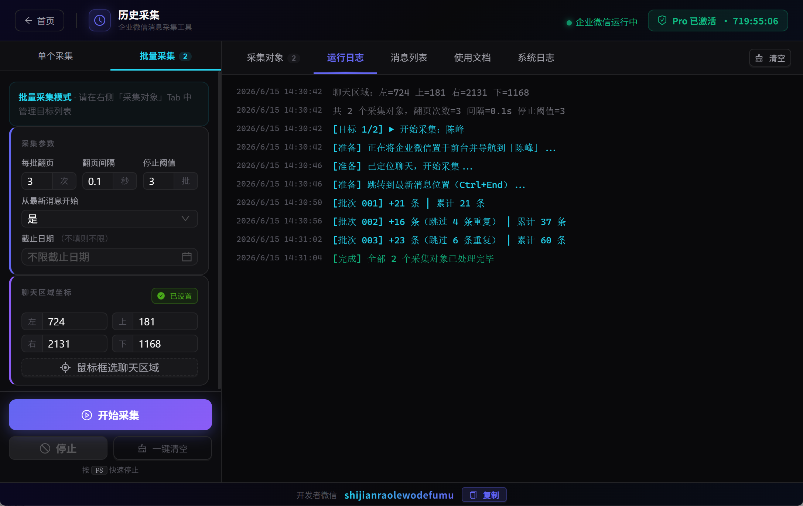
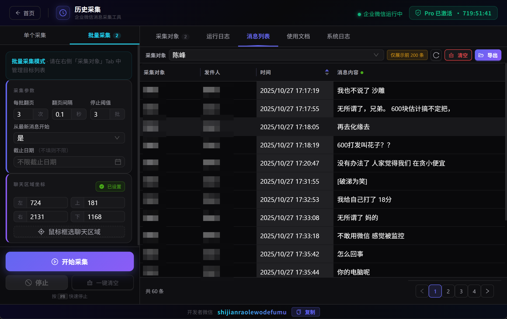
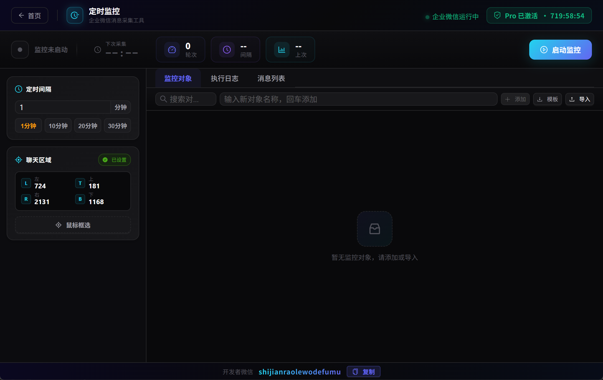
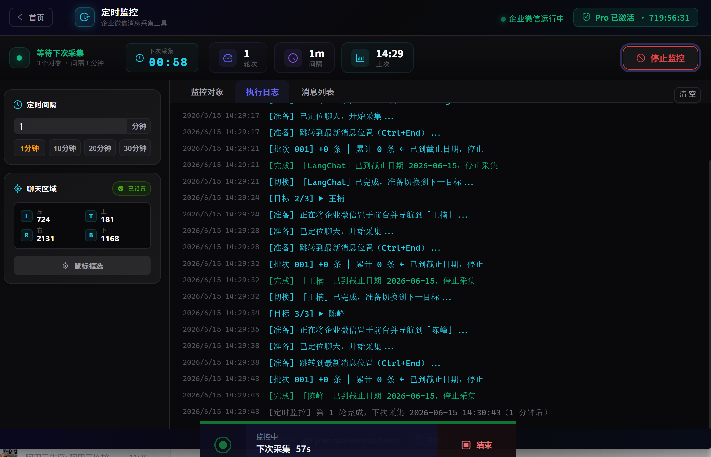

# 企业微信聊天记录采集 · 会话存档 · 导出 · 监控工具

> 企业微信聊天记录导出 / 企业微信会话存档 / 企业微信聊天备份 / 消息采集 / 群消息自动监控

自动操控企业微信，把指定联系人或群聊的历史消息整理成带时间戳、带发件人的 Excel 表格。**无需编程基础，解压即用。**

---

## 功能概览

| 模块 | 适用场景 |
|------|----------|
| **历史采集** | 一次性导出联系人/群聊的全部历史聊天记录，支持会话存档 |
| **定时监控** | 持续自动采集新消息，每次只写入增量，智能去重 |
| **智能回复** | *(即将上线)* AI 读懂对话，自动生成回复草稿 |

---

## 一、历史采集

把某个联系人或群聊从头到尾的消息**一次性归档**。

- **单个/批量**：支持单个采集，也支持导入 Excel 名单批量采集几十上百个对象
- **断点续采**：中途停止后，下次从断点继续，不重复、不遗漏
- **截止日期**：可设定只采集某时间点之前的消息
- **进度可见**：悬浮状态条实时显示采集对象、条数、耗时

---

## 二、定时监控

设好间隔，工具自动循环跑，**只追新增，不产生重复数据**。

- 启动后全自动运行，无需人工值守
- 支持手动添加或从 Excel 批量导入监控对象
- 每个对象数据独立存储，可在「消息列表」按对象切换查看

**典型用法：** 先用历史采集把存量消息导入，再开定时监控持续同步新消息。

---

## 导出格式

标准 Excel（.xlsx），打开即用：

| 采集对象 | 发件人 | 时间 | 消息内容 |
|----------|--------|------|----------|
| 项目Alpha客户群 | 张三 | 2025/06/01 14:32:18 | 好的，这个方案我们同意 |

---

## 安装与使用

1. 下载仓库（`git clone` 或直接下载 ZIP）
2. 解压文件夹内的 `.zip` 程序包
3. 双击 `.exe` 启动，无需安装 Python 或任何环境

**首次使用：**
1. 打开企业微信，显示目标聊天窗口
2. 工具中输入联系人/群聊名称
3. 点击「鼠标框选聊天区域」，在屏幕上框出聊天内容范围（一次即可）
4. 点击「开始采集」，等待完成后导出 Excel

---

## 常见问题

**需要账号密码吗？** 不需要。工具通过读取屏幕上已登录的企业微信操作，不接触账号凭证。

**采集时企业微信能最小化吗？** 不能。需保持界面可见，建议用副屏或单独一台电脑运行。

**支持哪些消息类型？** 目前支持文字消息，图片/文件/语音等后续扩展。

**数据会上传服务器吗？** 不会。所有数据只存本地，不上传任何第三方。

---

## 关键词

企业微信聊天记录导出 · 企业微信会话存档 · 企业微信聊天记录备份 · 企业微信聊天导出 · 企业微信消息采集 · 企业微信历史消息 · 企业微信群消息导出 · 企业微信聊天记录查询 · 企业微信自动化 · 企业微信 RPA · 企业微信消息监控 · 企业微信数据导出 Excel · 企业微信客服聊天记录 · 企业微信销售记录存档 · 企业微信聊天存档 · 企业微信消息存档

---

*问题或建议请通过 GitHub Issues 反馈。*
