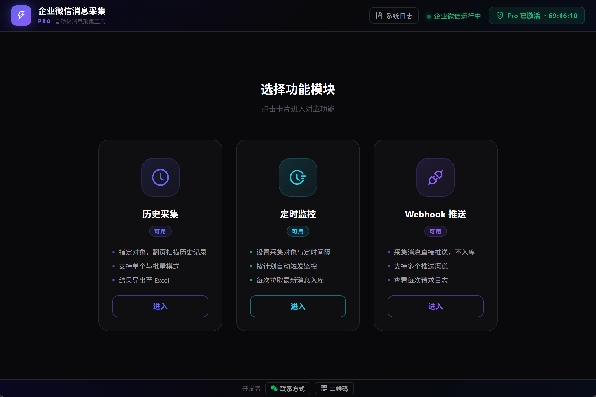
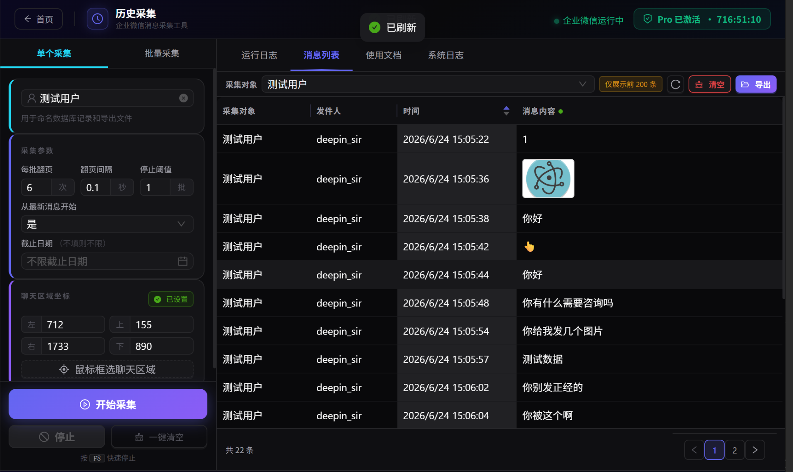
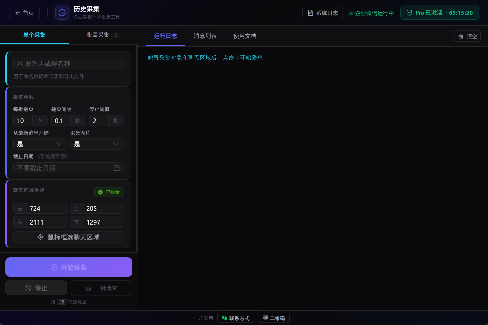
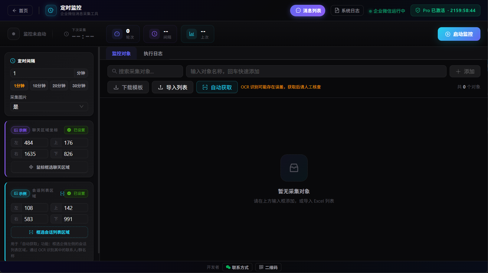
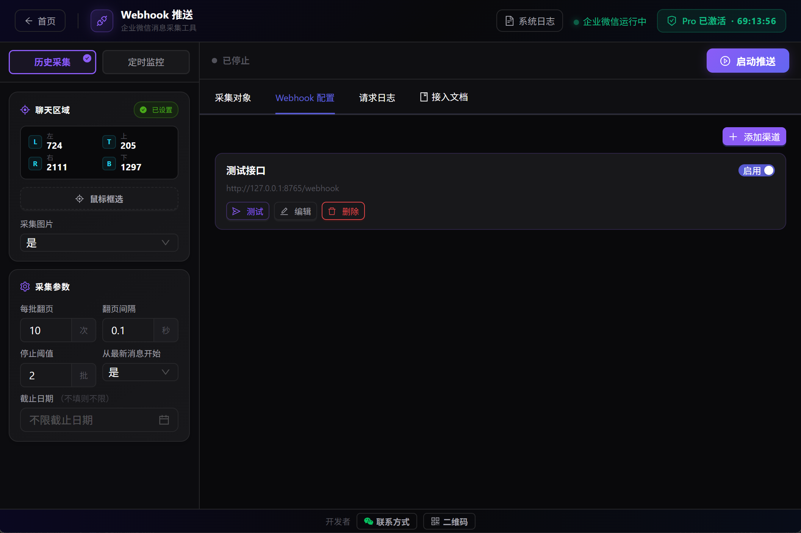
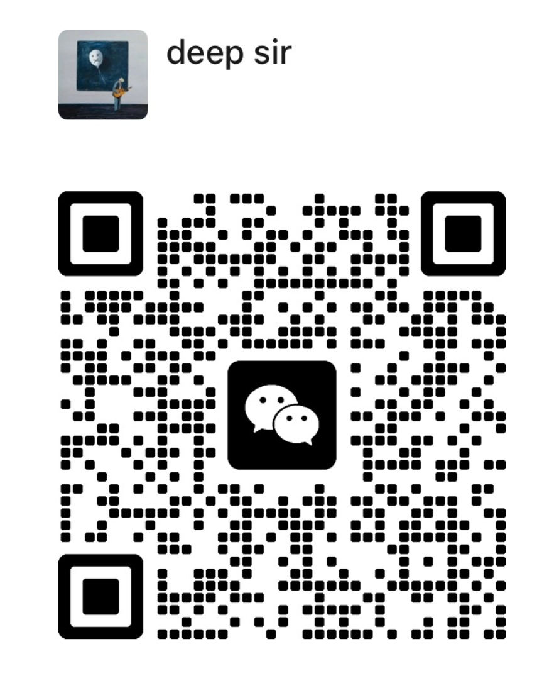

# 企业微信聊天记录导出工具 — 安全本地归档，消息不再丢失

> **关键词：** 企业微信 | 聊天记录导出 | 消息备份 | 聊天记录归档 | 群消息采集 | Webhook推送 | 数据本地存储

企业微信是数百万企业的日常沟通工具，但一个被忽视的现实是：**聊天记录随时可能丢失**。员工离职、手机换机、缓存清理……那些重要的客户对话、项目讨论、决策记录，说没就没。

这款工具，帮你把企业微信里的聊天记录**安全地保存到本地电脑**，不依赖任何云服务，不涉及任何破解行为。

---

## 为什么需要聊天记录归档？

**如果你是企业管理者：**
团队的核心沟通都在企业微信里。员工离职后，他和客户的聊天记录就断了。没有归档，就等于把客户关系拱手让人。

**如果你是销售负责人：**
客户从第一次咨询到最终成交，可能聊了几百条消息。这些对话是最真实的客户画像，但你现在只能靠销售的"记忆"和"笔记"来复盘。

**如果你是客服主管：**
你想回溯某次投诉的完整沟通过程，或者做服务质量分析，但企微不提供消息导出功能，一条一条截图效率太低。

**如果你是合规/法务：**
监管要求留存特定业务的沟通记录。聊天记录不归档，合规就永远是被动的。

**如果你是普通员工：**
项目群里讨论过的方案、领导在群里布置的任务、和同事确认过的细节——事后想找的时候，翻几百页聊天记录是最让人崩溃的事。

---

## 我们的解决方案：像"复制粘贴"一样简单

我们不破解企业微信，不逆向协议，不走任何灰色路线。

工具的原理很简单：**模拟人工操作企业微信客户端**。就像你自己在企微窗口里选中消息、按 Ctrl+C 复制、再粘贴到文档里一样——只不过这个过程是全自动的。

这带来几个关键优势：

- **安全合规** — 企业微信客户端正常运行，不做任何底层修改
- **所见即所得** — 你在企微里能看到的消息，工具就能采集到
- **数据完全在本地** — 所有聊天记录只存在你的电脑上，不上传任何第三方服务器
- **随时可控** — 随时开始、随时停止、随时删除已采集的数据

---

## 三大功能模块

### 一、历史消息采集 — 把过去的聊天记录补回来

针对指定的联系人或群聊，工具会自动向上翻页，把历史消息逐条采集下来，并保存到你的本地数据库。

**典型使用场景：**

- 新员工入职，快速了解项目群过去几个月的讨论内容
- 客户交接时，导出与该客户的完整沟通记录
- 季度末/年末，对重要群聊做一次完整的消息快照备份

**功能亮点：**

- 支持**单个采集和批量采集**，可以一次性导入几十个群聊目标
- 可以设置**日期范围**，只采集某个时间段内的消息
- 采集过程中有**悬浮进度条**，实时显示已采集的消息数量
- 支持**断点续采**，采集中断后下次自动从上次位置继续
- 聊天记录中的**图片也能一起采集**
- 采集完成后支持**一键导出为 Excel 文件**，方便分享给同事或归档

---

### 二、定时自动监控 — 让工具 7×24 小时替你盯着

设置好目标群聊和采集间隔，工具会在后台持续运行，定时检查新消息并自动保存。

**典型使用场景：**

- 销售团队需要持续记录与客户的每一次对话
- 合规部门需要留存特定群聊的全部沟通内容
- 客服主管需要自动归档所有客户咨询记录，用于质量分析

**功能亮点：**

- **智能模式** — 自动扫描企业微信的会话列表，发现未读消息并主动采集，无需手动指定目标
- **指定模式** — 按你预设的群聊列表逐个采集
- 采集间隔灵活可调，从几分钟到几小时，适配不同业务节奏
- 悬浮状态条清晰区分"等待中"和"采集中"两种状态

---

### 三、Webhook 实时推送 — 采集到的消息，实时送到你的业务系统

通过 Webhook，将采集到的聊天记录自动推送到企业微信机器人、钉钉、飞书、Slack，或你们自己的管理系统。

**典型使用场景：**

- 重要客户群的消息实时同步到管理层的消息看板
- 客服对话记录自动转发给质检系统做合规审查
- 关键项目的群聊消息实时同步到项目管理系统
- 销售与客户的对话自动归档到 CRM 系统

**功能亮点：**

- 支持配置**多个推送渠道**，同一消息可同时推送到多个系统
- 推送前可以**一键测试**渠道是否连通
- 每次推送都有**完整的请求日志**，出了问题可以精准定位
- 消息以标准格式推送，下游系统可以直接使用，无需额外开发

---

## 数据安全，我们是认真的

| 关注点 | 我们的做法 |
|-------|----------|
| 数据存储在哪？ | 仅存储在你的本地电脑，不上传任何云端 |
| 数据加密吗？ | 所有消息内容采用军用级加密算法存储，即使电脑丢失也不会泄露 |
| 会不会泄露数据？ | 不联网、不上传、不传输，数据只在你自己的电脑上 |
| 采集过程安全吗？ | 不破解、不逆向，企业微信客户端正常运行 |
| 可以删除数据吗？ | 随时可以删除已采集的任何数据，完全由你控制 |

---

## 谁在用这款工具？

| 角色 | 使用场景 |
|------|---------|
| 企业管理者 | 留存团队沟通记录，降低核心信息流失风险 |
| 销售团队 | 系统化归档客户对话，提升客户管理和服务质量 |
| 客服团队 | 自动归档客户咨询记录，支撑服务质量分析 |
| 合规/法务 | 满足沟通记录留存的合规监管要求 |
| HR/行政 | 备份员工培训群、公告群的重要通知 |
| 项目经理 | 归档项目群讨论内容，沉淀项目知识 |
| 个人用户 | 备份重要的工作沟通记录，随时可查可溯 |

---

## 常见问题

**Q：这个工具会封号吗？**
不会。工具只是模拟人工操作企业微信客户端，不涉及任何协议破解或数据篡改。

**Q：采集到的数据存在哪里？**
只存在你本机的硬盘上。我们不收集、不上传、不传输任何用户数据。

**Q：支持采集图片吗？**
支持。聊天记录中的图片会随消息一起采集保存。

**Q：可以同时采集多个群吗？**
可以。支持批量导入采集目标，一次性采集数十个群聊的消息。

**Q：采集中断了怎么办？**
工具支持断点续采，中断后下次启动会自动从上次的位置继续，不会重复采集。

**Q：怎么把采集到的数据拿出来？**
支持一键导出为 Excel 文件，也支持通过 Webhook 实时推送到其他系统。

**Q：采集过程中我还能用电脑吗？**
工具会自动操控企业微信窗口进行采集，采集期间建议不要手动操作企微窗口。采集完成后窗口恢复正常使用。

**Q：需要企业微信管理员权限吗？**
不需要。只要你的企业微信账号能看到对应的聊天记录，工具就可以采集。

---

## 快速上手

1. 从 [Releases](https://github.com/a605204746/rpa_wxcom_chat_public/releases) 页面下载最新版本安装包
2. 双击安装，启动工具
3. 确保企业微信客户端已登录并在后台运行
4. 选择功能模块 → 添加采集目标 → 点击开始
5. 在消息列表中查看结果，或导出 Excel

就这么简单，四步搞定。

---

## 最后

我们不制造数据，我们只是帮你把**已经存在的数据**安全地保存下来。

聊天记录是企业最有价值、却也最容易被忽视的数据资产。别让重要的沟通记录消失在历史里。

**如果这款工具对你有帮助，请给我们一个 Star ⭐，让更多人看到。**

如需企业定制或技术支持，欢迎联系作者。

---

## 相关关键词索引

> *本节帮助搜索引擎收录，方便有相同需求的用户找到这个工具。*

企业微信聊天记录导出、企业微信历史消息备份、企业微信会话存档替代方案、企业微信消息采集工具、企业微信聊天记录存档、WeCom chat export tool、WeCom message archive、企业微信数据备份、企业微信消息导出Excel、企业微信聊天记录检索、企业微信RPA自动化、企业微信消息同步、聊天记录定时备份、企业微信Webhook集成

---

*本工具仅用于个人或企业自身的聊天记录本地归档和备份，请遵守相关法律法规及企业信息安全政策。*
